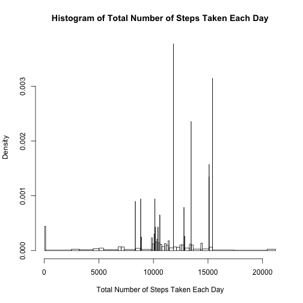
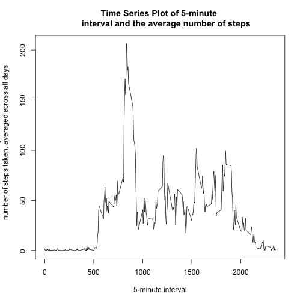
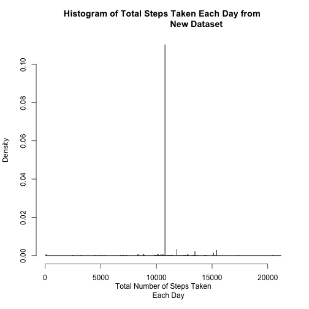
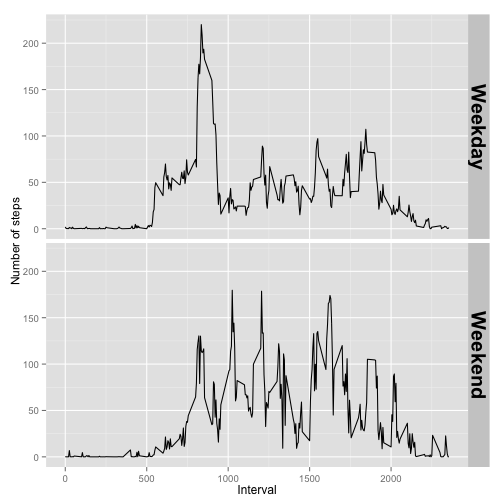

##R Markdown by Allen S.C. Tang

###For Repreducible Research Assignment 1

####Loading and preprocessing the data
Load the data and covert class of date column:

```r
oridata<-read.csv("activity.csv")
oridata[,2]<-as.character(oridata[,2])
oridata[,2]<-as.Date(oridata[,2],format="%Y-%m-%d")
```

####Q1: What is mean total number of steps taken per day?
Calculate the attributes of steps for each day:

```r
comdata<-subset(oridata,complete.cases(oridata))
cdates<-unique(comdata[,2])
daystep<-data.frame()
for(z in 1:length(cdates)){
        dstep<-data.frame()
        sumstep<-c()
        dstep<-subset(comdata,comdata[,2]==cdates[z])
        sumstep<-c(as.character(dstep[1,2]),sum(dstep[,1]),
                   mean(dstep[,1]),median(dstep[,1]))
        daystep<-rbind(daystep,sumstep)
        daystep[,1]<-as.character(daystep[,1])
        daystep[,1]<-as.Date(daystep[,1],format="%Y-%m-%d")
        daystep[,2]<-as.numeric(as.character(daystep[,2]))
        daystep[,3]<-as.numeric(as.character(daystep[,3]))
        daystep[,4]<-as.numeric(as.character(daystep[,4]))
        dstep<-NULL
        sumstep<-NULL
}
names(daystep)<-c("Dates","Steps_Day_Total","Steps_Day_Mean","Steps_Day_Median")
```

And the histogram of total number of steps taken each day looks like:

```r
hist(daystep[,2],breaks=unique(daystep[,2]),xlab="Total Number of Steps Taken Each Day",
     main=paste("Histogram of Total Number of Steps Taken Each Day"))
```

 

Finally, the mean and median of the total number of steps taken per day are:

```r
cat("The mean is",mean(daystep[,2]))
```

```
## The mean is 10766.19
```

```r
cat("And the median is",median(daystep[,2]))
```

```
## And the median is 10765
```

####Q2: What is the average daily activity pattern?
Re-arrange data for 5-minute interval

```r
comdata<-subset(oridata,complete.cases(oridata))
cmin<-unique(comdata[,3])
fiveminstep<-data.frame()
for(y in 1:length(cmin)){
        mstep<-data.frame()
        minstep<-c()
        mstep<-subset(comdata,comdata[,3]==cmin[y])
        minstep<-c(mstep[1,3],sum(mstep[,1]),mean(mstep[,1]))
        fiveminstep<-rbind(fiveminstep,minstep)
        fiveminstep[,1]<-as.numeric(as.character(fiveminstep[,1]))
        fiveminstep[,2]<-as.numeric(as.character(fiveminstep[,2]))
        fiveminstep[,3]<-as.numeric(as.character(fiveminstep[,3]))
        mstep<-NULL
        minstep<-NULL
}
names(fiveminstep)<-c("Interval","Steps_5Min_Total","Steps_5Min_Mean")
```

And the time series plot looks like:

```r
plot(fiveminstep[,1],fiveminstep[,3],type="l",main="Time Series Plot of 5-minute 
     interval and the average number of steps",xlab="5-minute interval",ylab="average 
     number of steps taken, averaged across all days")
```

 

And the max number of steps goes to the interval of:

```r
maxint<-subset(fiveminstep,fiveminstep[,2]==max(fiveminstep[,2]))
cat("The max number of steps occurs in the interval of",maxint$Interval)
```

```
## The max number of steps occurs in the interval of 835
```

####Q3: Imputing missing values
The total number of rows with NAs is the difference between original dataset and the dataset processed by the "complete.cases" function. The number is:

```r
length(oridata[,1])-length(comdata[,1])
```

```
## [1] 2304
```

In my opinion, the filling srategy should base on the mean of 5-minute interval step records. Because the steps subject took with monitoring device could be in a regular pattern under normal conditions.
According to the strategy, the new dataset will be the original dataset with the NAs filled by the mean of the steps in the same 5-min interval:

```r
newdata<-oridata
for(x in 1:length(oridata[,1])){
        if(is.na(newdata[x,1])==TRUE){
                tempmean<-subset(fiveminstep,newdata[x,3]==fiveminstep[,1])
                newdata[x,1]<-tempmean[,3]
                tempmean<-NULL
        }
}
```

And the new total, mean and median steps of the new dataset are:

```r
new_cdates<-unique(newdata[,2])
newdaystep<-data.frame()
for(w in 1:length(new_cdates)){
        new_dstep<-data.frame()
        new_sumstep<-c()
        new_dstep<-subset(newdata,newdata[,2]==new_cdates[w])
        new_sumstep<-c(as.character(new_dstep[1,2]),sum(new_dstep[,1]),
                   mean(new_dstep[,1]),median(new_dstep[,1]))
        newdaystep<-rbind(newdaystep,new_sumstep)
        newdaystep[,1]<-as.character(newdaystep[,1])
        newdaystep[,1]<-as.Date(newdaystep[,1],format="%Y-%m-%d")
        newdaystep[,2]<-as.numeric(as.character(newdaystep[,2]))
        newdaystep[,3]<-as.numeric(as.character(newdaystep[,3]))
        newdaystep[,4]<-as.numeric(as.character(newdaystep[,4]))
        new_dstep<-NULL
        new_sumstep<-NULL
}
names(newdaystep)<-c("Dates","Steps_Day_Total","Steps_Day_Mean","Steps_Day_Median")
cat("The new mean of total number of steps taken per day from the new dataset is",mean(newdaystep[,2]))
```

```
## The new mean of total number of steps taken per day from the new dataset is 10766.19
```

```r
cat("The new median of total number of steps taken per day from the new dataset is",median(newdaystep[,2]))
```

```
## The new median of total number of steps taken per day from the new dataset is 10766.19
```

And the new histogram looks like:

```r
hist(newdaystep[,2],breaks=unique(newdaystep[,2]),xlab="Total Number of Steps Taken
     Each Day", main=paste("Histogram of Total Steps Taken Each Day from 
                           New Dataset"))
```

 

The differences of 2 means and medians from datasets with and without NAs are:

```r
cat("The difference between 2 means is",mean(daystep[,2])-mean(newdaystep[,2]))
```

```
## The difference between 2 means is -3.637979e-12
```

```r
cat("The difference between 2 medians is",median(daystep[,2])-median(newdaystep[,2]))
```

```
## The difference between 2 medians is -1.188679
```

As numbers and figures above show, the new mean is almost the same as old one, and the new median is a little bigger than old one. But the new histogram is a totally different figure compare to the previous one.

After applying the strategy by filling the mean of 5-minute interval steps to NAs, the major impact to the original data is the abnormal and extreme high density of total number of steps. It comes from the NA records in 8 days are replaced by the same number(mean) in the same interval.

When exploratory analyses are implemented on the old and new datasets at the same time, a researcher could be mislead to faulty results if he/she studies the histograms from 2 datasets only.

####Q4: Are there differences in activity patterns between weekdays and weekends?
Add the "weekday" and "weekend" into new dataset:

```r
Sys.setlocale("LC_TIME", "en_US")
```

```
## [1] "en_US"
```

```r
for(v in 1:length(newdata[,2])){
        newdata[v,4]<-weekdays(newdata[v,2])
        if(newdata[v,4]=="Saturday") newdata[v,5]<-c("Weekend")
        if(newdata[v,4]=="Sunday") newdata[v,5]<-c("Weekend")
        else newdata[v,5]<-c("Weekday")
}
names(newdata)<-c("steps","date","interval","Weekday","Day_End")
```

I will use ggplot2 package to plot the coming panel plot.

And the time series panel plot seperated by weekday and weekend looks like:

```r
dataday<-subset(newdata,newdata[,5]=="Weekday")
dataend<-subset(newdata,newdata[,5]=="Weekend")
panelday<-data.frame()
panelend<-data.frame()
for(u in 1:length(cmin)){
        tempday<-subset(dataday,dataday[,3]==cmin[u])
        panelday[u,1]<-cmin[u]
        panelday[u,2]<-mean(tempday[,1])
        panelday[u,3]<-c("Weekday")
        tempday<-NULL
        tempend<-subset(dataend,dataend[,3]==cmin[u])
        panelend[u,1]<-cmin[u]
        panelend[u,2]<-mean(tempend[,1])
        panelend[u,3]<-c("Weekend")
        tempend<-NULL
}
plotdata<-data.frame()
plotdata<-rbind(panelday,panelend)
names(plotdata)<-c("Interval","Step_5Min_Mean","Day_End")
plotdata$Day_End<-as.factor(plotdata$Day_End)

library(ggplot2)
pplot<-ggplot(plotdata,aes(Interval,Step_5Min_Mean))+geom_line()+facet_grid(Day_End ~ .)
p2plot<-pplot+xlab("Interval")+ylab("Number of steps")+theme(strip.text.y = element_text(size=20, face="bold"))
print(p2plot)
```

 

All the questions in the assignment 1 are answered.

####End of the R markdown file
